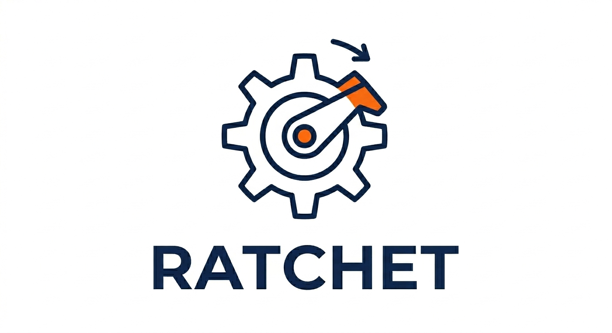

# ratchet-sm



[](https://github.com/sonic182/ratchet/actions/workflows/ci.yml)
[](https://pypi.org/project/ratchet-sm/)

A pure, provider-agnostic state machine for normalizing and recovering structured LLM outputs.

`ratchet-sm` gives you a reliable way to extract structured data from LLM responses — handling retries, validation feedback, multi-step flows, and fixer prompts — without being tied to any specific model provider or framework.

---

## Table of Contents

- [Getting Started](#getting-started)
  - [Features](#features)
  - [Installation](#installation)
  - [Quickstart](#quickstart)
- [Reference](#reference)
  - [Schemas](#schemas)
  - [Normalizers](#normalizers)
    - [HEALING_PIPELINE](#healing_pipeline)
  - [Strategies](#strategies)
  - [Multi-state flows](#multi-state-flows)
  - [Actions reference](#actions-reference)
- [Advanced](#advanced)
  - [Custom normalizer](#custom-normalizer)
  - [Custom strategy](#custom-strategy)
  - [Provider Native JSON Schema](#provider-native-json-schema)
  - [Tool-call mode](#tool-call-mode)
  - [Native tool calls](#native-tool-calls)
  - [Passthrough state](#passthrough-state)
  - [reset()](#reset)
- [Examples](#examples)
- [Why not just use instructor retries?](#why-not-just-use-instructor-retries)

---

## Getting Started

### Features

- **Provider-agnostic** — works with OpenAI, Anthropic, or any LLM
- **Pure state machine** — no I/O, no LLM calls; you own the call loop
- **Normalizer pipeline** — strips fences, parses JSON/YAML/frontmatter, repairs malformed JSON automatically
- **Schema support** — plain `dict`, Python `dataclass`, or Pydantic `BaseModel`
- **Retry strategies** — `ValidationFeedback`, `SchemaInjection`, or `Fixer`
- **Multi-state flows** — linear or branching transitions between extraction steps
- **Tool-call mode** — extracts pseudo tool calls from XML tags, labelled fences, and bracket tags; returns targeted feedback when the model misses the call
- **Native tool calls** — pass `tool_calls=` from provider responses directly into `receive()` for uniform validation and state advancement
- **Passthrough states** — free-form chat states that forward raw text straight through without parsing
- **Observable** — every action is a plain dataclass you can inspect or log

### Installation

```bash
# minimal (JSON parsing only)
pip install ratchet-sm

# with Pydantic support
pip install "ratchet-sm[pydantic]"

# with YAML support (ParseYAML normalizer, SchemaInjection format="yaml")
pip install "ratchet-sm[yaml]"

# with frontmatter support (ParseFrontmatter normalizer)
pip install "ratchet-sm[frontmatter]"

# everything
pip install "ratchet-sm[all]"
```

### Quickstart

```python
import openai
from pydantic import BaseModel

from ratchet_sm import FailAction, RetryAction, State, StateMachine, ValidAction
from ratchet_sm.normalizers import ParseJSON, StripFences


class Person(BaseModel):
    name: str
    age: int


client = openai.OpenAI()

machine = StateMachine(
    states={
        "extract": State(name="extract", schema=Person, normalizers=[StripFences(), ParseJSON()])
    },
    transitions={},
    initial="extract",
)

messages = [{"role": "user", "content": 'Extract as JSON: Alice is 30 years old.'}]

while not machine.done:
    response = client.chat.completions.create(model="gpt-4o-mini", messages=messages)
    raw = response.choices[0].message.content

    action = machine.receive(raw)

    if isinstance(action, ValidAction):
        print(action.parsed)  # Person(name='Alice', age=30)

    elif isinstance(action, RetryAction):
        messages.append({"role": "assistant", "content": raw})
        messages.append({"role": "user", "content": action.prompt_patch})

    elif isinstance(action, FailAction):
        raise RuntimeError(f"Failed after {action.attempts} attempts: {action.reason}")
```

---

## Reference

### Schemas

#### `dict` (no schema)

```python
State(name="extract")  # returns the parsed dict as-is
```

#### Python `dataclass`

```python
import dataclasses

@dataclasses.dataclass
class Person:
    name: str
    age: int

State(name="extract", schema=Person)
# ValidAction.parsed is a Person instance
```

#### Pydantic `BaseModel`

```python
from pydantic import BaseModel

class Person(BaseModel):
    name: str
    age: int

State(name="extract", schema=Person)
# ValidAction.parsed is a validated Person instance
```

### Normalizers

The normalizer pipeline converts a raw LLM string into a `dict`. Steps are tried in order; the first success wins.

| Normalizer         | What it does                                                   |
| ------------------ | -------------------------------------------------------------- |
| `StripFences`      | Strips ` ```json ... ``` ` markdown code fences (preprocessor) |
| `ParseJSON`        | Parses JSON, handles BOM and whitespace                        |
| `ParseYAML`        | Parses YAML dicts (`yaml.safe_load`)                           |
| `ParseFrontmatter` | Parses `---` frontmatter blocks                                |
| `RepairJSON`       | Repairs malformed JSON (missing brackets, trailing commas, unquoted keys, mixed text + JSON) |

**Default pipeline**: `[StripFences(), ParseJSON(), ParseYAML(), ParseFrontmatter()]`

#### Recommended configurations

| Goal                                       | Pipeline / constant                                                                   |
| ------------------------------------------ | ------------------------------------------------------------------------------------- |
| JSON responses (or any format, default)    | `[StripFences(), ParseJSON(), ParseYAML(), ParseFrontmatter()]` — omit `normalizers=` |
| YAML-only responses                        | `[StripFences(), ParseYAML()]`                                                        |
| Frontmatter responses (with YAML fallback) | `[StripFences(), ParseFrontmatter(), ParseYAML()]`                                    |
| Malformed / healing (OpenRouter, weak LLMs) | `HEALING_PIPELINE` — see below                                                       |

For the frontmatter+YAML fallback: some models respond with a plain YAML code block (no `---` delimiters), so `ParseYAML()` after `ParseFrontmatter()` catches that gracefully.

#### `HEALING_PIPELINE`

Use `HEALING_PIPELINE` when the model may emit malformed JSON — common with weaker models or OpenRouter's response healing scenarios. It runs `StripFences` and `ParseJSON` first (fast path), then falls back to `RepairJSON` which handles:

- Missing closing brackets/braces — `{"name": "Alice", "age": 30` → `{"name": "Alice", "age": 30}`
- Trailing commas — `{"name": "David",}` → `{"name": "David"}`
- Unquoted keys — `{name: "Eve", age: 40}` → `{"name": "Eve", "age": 40}`
- Mixed text + JSON — `Here's the data: {"name": "Bob"}` → `{"name": "Bob"}`

```python
from ratchet_sm.normalizers import HEALING_PIPELINE

State(name="extract", schema=Person, normalizers=HEALING_PIPELINE)
```

You can override it per state:

```python
from ratchet_sm.normalizers import ParseJSON, StripFences

State(name="extract", normalizers=[StripFences(), ParseJSON()])
```

### Strategies

Strategies decide what to do when parsing or validation fails. They produce a `prompt_patch` string to append to your next LLM call.

#### `ValidationFeedback` (default)

Returns a message listing the errors and the schema:

```python
from ratchet_sm.strategies import ValidationFeedback

State(name="extract", strategy=ValidationFeedback())
```

#### `SchemaInjection`

Returns the schema serialized in the requested format — useful when you want to remind the model of the exact shape:

```python
from ratchet_sm.strategies import SchemaInjection

State(name="extract", schema=Person, strategy=SchemaInjection(format="yaml"))
```

Supported formats: `"json_schema"` (default), `"yaml"`, `"simple"`.

#### `Fixer`

Instead of a retry hint, emits a `FixerAction` with a full self-contained prompt you can send to a separate LLM call (or a different, more capable model):

```python
from ratchet_sm.strategies import Fixer

State(name="extract", strategy=Fixer())
```

```python
elif isinstance(action, FixerAction):
    # Send action.fixer_prompt to a capable model, then feed the response back
    fixer_response = call_llm(action.fixer_prompt)
    action = machine.receive(fixer_response)
```

### Multi-state flows

#### Linear

```python
machine = StateMachine(
    states={
        "classify": State(name="classify"),
        "extract":  State(name="extract", schema=Person),
    },
    transitions={"classify": "extract"},
    initial="classify",
)
```

#### Branching (callable transition)

```python
machine = StateMachine(
    states={
        "classify": State(name="classify"),
        "person":   State(name="person",   schema=Person),
        "company":  State(name="company",  schema=Company),
    },
    transitions={
        "classify": lambda parsed: "person" if parsed["type"] == "person" else "company",
    },
    initial="classify",
)
```

#### The loop

```python
# Per-state prompts — each state needs its own instruction
prompts = {
    "classify": "Is the text about a person or a company? Respond with JSON: {\"type\": \"person\"} or {\"type\": \"company\"}.",
    "person":   "Extract the person's name, age, occupation, and location as JSON.",
    "company":  "Extract the company's name, founding year, industry, and headquarters as JSON.",
}

messages = [{"role": "user", "content": prompts["classify"]}]

while not machine.done:
    raw = call_llm(messages)
    action = machine.receive(raw)

    if isinstance(action, ValidAction):
        if not machine.done:
            # Machine transitioned; start a fresh conversation for the next state
            next_state = machine.current_state.name
            messages = [{"role": "user", "content": prompts[next_state]}]

    elif isinstance(action, RetryAction):
        messages.append({"role": "assistant", "content": raw})
        messages.append({"role": "user", "content": action.prompt_patch})

    elif isinstance(action, FailAction):
        raise RuntimeError(f"Failed in '{action.state_name}': {action.reason}")
```

Key rule: when `ValidAction` arrives and `not machine.done`, the machine has already
moved to the next state — `machine.current_state.name` gives the new state name.
Reset `messages` with a prompt appropriate for that state before the loop continues.

### Actions reference

Every `machine.receive(raw)` call returns one of:

| Action                 | Meaning                                                                                                              |
| ---------------------- | -------------------------------------------------------------------------------------------------------------------- |
| `ValidAction`          | Parsing and validation succeeded. `.parsed` holds the result. `.format_detected` is e.g. `"json"`, `"native_tool_call"`, `"passthrough"`. |
| `RetryAction`          | Failed; `.prompt_patch` is the hint to add to the next prompt. `.reason` is `"parse_error"` or `"validation_error"`. |
| `FixerAction`          | Failed with `Fixer` strategy; `.fixer_prompt` is a ready-to-send repair prompt.                                      |
| `ToolCallMissingAction`| No tool call found in the response (requires_tool_call=True). `.reason` is `"no_tool_call"` or `"pseudo_tool_call_in_text"`. `.prompt_patch` contains recovery instructions. |
| `FailAction`           | Exceeded `max_attempts`; `.history` is the full action trail.                                                        |

All actions expose `.attempts`, `.state_name`, and `.raw`.

---

## Advanced

### Custom normalizer

```python
from ratchet_sm.normalizers.base import Normalizer

class ParseTOML(Normalizer):
    name = "toml"

    def normalize(self, raw: str) -> dict | None:
        import tomllib
        try:
            return tomllib.loads(raw)
        except Exception:
            return None

State(name="extract", normalizers=[ParseTOML()])
```

### Custom strategy

```python
from ratchet_sm.strategies.base import Strategy, FailureContext

class SlackAlert(Strategy):
    def on_failure(self, context: FailureContext) -> str | None:
        post_to_slack(f"Attempt {context.attempts} failed: {context.errors}")
        return f"Please fix the errors: {context.errors}"

State(name="extract", strategy=SlackAlert())
```

### Provider Native JSON Schema

If your provider supports native JSON schema enforcement (OpenAI, OpenRouter, Gemini),
you can send a schema in the API request and still keep `ratchet-sm` as the canonical
validator/state machine.

#### Recommended pattern

1. Keep `State.schema` as your source of truth (`dataclass`/Pydantic).
2. Derive JSON schema for provider calls from `state.schema`.
3. Apply provider profile adjustments (for example, OpenAI stricter, Gemini looser).
4. Always pass the response back into `machine.receive(raw)` for uniform validation,
   retry actions, and transitions.

Schema derivation uses Pydantic v2 `TypeAdapter(...).json_schema()` under the hood,
so both `BaseModel` and plain Python `dataclass` schemas are supported through
the same adapter path.

`ratchet-sm` includes helper utilities for this:

```python
from ratchet_sm import (
    apply_provider_schema_profile,
    derive_provider_state_json_schema,
    derive_state_json_schema,
)
```

Optional per-state API overrides can be maintained outside the machine
(`dict[state_name, json_schema]`) when a specific provider/model needs a tailored payload.

If you need OpenAI/OpenRouter-style strict normalization where every property is forced
into `required`, opt in explicitly:

```python
profiled = apply_provider_schema_profile(
    "openai",
    schema,
    enforce_all_properties_required=True,
)
```

See [`examples/structured_native_schema_hybrid.py`](examples/structured_native_schema_hybrid.py).

### Tool-call mode

When a state has `requires_tool_call=True`, ratchet routes the text response through the `TOOL_CALL_PIPELINE`, which recognizes three pseudo tool-call patterns emitted by models that do not support native function calling:

| Pattern | Example |
|---|---|
| XML tag | `<tool_call>{"name": "search", "input": {"q": "hi"}}</tool_call>` |
| Labelled fence | ` ```tool_call\n{"name": "search"}\n``` ` |
| Bracket tag | `[TOOL_CALL]{"name": "search"}[/TOOL_CALL]` |

Plain JSON with no tag is also accepted as a fallback.

```python
from ratchet_sm import State, StateMachine, ToolCallMissingAction, ValidAction

machine = StateMachine(
    states={"call": State(name="call", requires_tool_call=True)},
    transitions={},
    initial="call",
)

while not machine.done:
    raw = call_llm(messages)
    action = machine.receive(raw)

    if isinstance(action, ValidAction):
        tool_call = action.parsed  # dict with at least "name"

    elif isinstance(action, ToolCallMissingAction):
        # action.reason: "no_tool_call" or "pseudo_tool_call_in_text"
        messages.append({"role": "assistant", "content": raw})
        messages.append({"role": "user", "content": action.prompt_patch})
```

You can customize feedback prompts via `RequireToolCallFeedback`:

```python
from ratchet_sm.strategies import RequireToolCallFeedback

State(
    name="call",
    requires_tool_call=True,
    strategy=RequireToolCallFeedback(
        no_call_template="You must respond with a tool call.",
        pseudo_call_template="Your tool call tag had invalid JSON. Please fix it.",
    ),
)
```

### Native tool calls

When the provider returns `response.tool_calls` natively (OpenAI, Anthropic, etc.), pass them directly into `receive()`:

```python
response = client.chat.completions.create(
    model="gpt-4o",
    tools=[...],
    messages=messages,
)

action = machine.receive(
    raw=response.choices[0].message.content or "",
    tool_calls=response.choices[0].message.tool_calls,
)
```

ratchet normalizes the tool call via a duck-typed extractor that handles:
- Dicts with `"name"` / `"input"` keys (Anthropic-style)
- Objects with `.name` / `.input` attributes
- OpenAI-style `function.arguments` — both JSON strings and dicts

The extracted dict is validated against `state.schema` exactly like any other response. On success, `ValidAction.format_detected == "native_tool_call"`. An empty `tool_calls=[]` returns `ToolCallMissingAction`. Passing `tool_calls=None` falls through to the text pipeline (backward compatible).

When `requires_tool_call=False` (the default), the `tool_calls` parameter is silently ignored and the existing text pipeline runs on `raw`.

### Passthrough state

A state with `passthrough=True` skips all parsing and returns the raw text directly as a `ValidAction`. This is useful for free-form chat steps inside multi-step flows.

```python
machine = StateMachine(
    states={
        "chat":    State(name="chat",    passthrough=True),
        "extract": State(name="extract", schema=Person),
    },
    transitions={"chat": "extract"},
    initial="chat",
)

action = machine.receive("Sure, tell me more about Alice.")
# ValidAction(parsed="Sure, tell me more about Alice.", format_detected="passthrough")
```

`schema` is ignored when `passthrough=True`. The state still respects `max_attempts` — a `FailAction` is returned if the guard fires before the passthrough branch.

### `reset()`

Resets the machine to its initial state, clearing all counters and history:

```python
machine.reset()
```

---

## Examples

| Example | Demonstrates |
|---|---|
| [`examples/yaml_dict.py`](examples/yaml_dict.py) | YAML normalizer, plain `dict` output, parallel models via OpenRouter |
| [`examples/frontmatter_dataclass.py`](examples/frontmatter_dataclass.py) | Frontmatter normalizer, `dataclass` schema, `SchemaInjection` strategy |
| [`examples/openrouter_all_models.py`](examples/openrouter_all_models.py) | Pydantic schema, default JSON pipeline, parallel multi-model comparison |
| [`examples/multi_state_gemma.py`](examples/multi_state_gemma.py) | Multi-state branching (classify → extract), Pydantic, Gemma 3 via OpenRouter |
| [`examples/structured_native_schema_hybrid.py`](examples/structured_native_schema_hybrid.py) | Provider-native JSON schema + ratchet-sm canonical validation, hybrid per-state retry policy |
| [`examples/tool_call_loop.py`](examples/tool_call_loop.py) | Tool-call loop with pseudo-call extraction, `RequireToolCallFeedback`, OpenRouter + DeepSeek v3.2-exp |

All examples require the `llm-async` package (`pip install llm-async`) and
an `OPENROUTER_API_KEY` environment variable.

---

## Why not just use instructor retries?

|                      | instructor                  | ratchet-sm              |
| -------------------- | --------------------------- | ----------------------- |
| Provider coupling    | OpenAI, Anthropic, Google…  | Any LLM (you own loop)  |
| Schema required      | Yes (Pydantic)              | No (dict, dataclass, Pydantic) |
| Stateful multi-step  | No                          | Yes                     |
| Branching flows      | No                          | Yes                     |
| Observable actions   | No                          | Yes                     |
| Custom repair models | No                          | Yes (`Fixer`)           |
